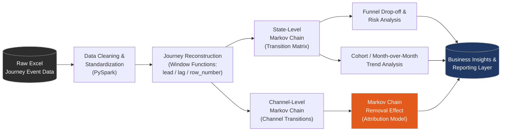

<div align="center">

# 🔗 Customer Journey Analytics & Markov Chain Attribution Model

### Multi-Touch Marketing Attribution using Markov Chains, PySpark & Databricks

# [](https://www.python.org/)
# [](https://spark.apache.org/)
# [](https://www.databricks.com/)
# [](https://pandas.pydata.org/)
# [](#license)

**Reconstructing customer journeys and fairly attributing conversions across marketing channels — using probabilistic modeling instead of last-touch guesswork.**

[Overview](#-overview) • [Architecture](#-pipeline-architecture) • [Methodology](#-methodology) • [Results](#-key-results--insights) • [Tech Stack](#-tech-stack) • [How to Run](#-how-to-run) • [Repo Structure](#-repository-structure)

</div>

---

## 📌 Overview

Most marketing attribution is broken. First-touch and last-touch models give **100% credit to a single channel**, ignoring every other touchpoint that influenced a customer's decision. This project fixes that.

Using a real multi-touch, multi-channel customer journey dataset from a **digital credit card / loan onboarding funnel**, this project:

- Reconstructs every customer's end-to-end journey from raw, unordered event logs
- Models journey behavior as a **first-order Markov Chain** (state-transition probabilities)
- Applies the **Markov Chain Removal Effect** — a game-theoretic attribution technique — to quantify each channel's *true* incremental contribution to conversions
- Surfaces funnel drop-off points, channel performance, and month-over-month acquisition trends

> 📊 **Business question answered:** *"If we removed WhatsApp / Call Center / DSA Agent from our marketing mix entirely, how many conversions would we actually lose?"*

<p align="center">
  
  <br>
  <sub>📌 Add a screenshot of your transition matrix, funnel chart, or attribution table here — see <a href="#-adding-your-own-visuals">Adding Your Own Visuals</a></sub>
</p>

---

## 🧭 Pipeline Architecture



---

## 🔬 Methodology

| Stage | Technique | What It Does |
|---|---|---|
| **1. Ingestion & Cleaning** | PySpark + Pandas/openpyxl | Loads raw Excel event logs into Spark; standardizes text fields, parses timestamps, applies business-rule null imputation |
| **2. Journey Reconstruction** | Spark Window Functions (`lead`, `lag`, `row_number`) | Rebuilds each customer's chronological event sequence from unordered logs |
| **3. State-Level Markov Chain** | Transition counts → probabilities → pivoted matrix | Models the probability of moving from one funnel state to the next (e.g., `PAN_VERIFIED → CIBIL_CHECK`) |
| **4. Segmentation** | Grouped transition matrices | Breaks the Markov Chain down by lead type (Assisted vs. Non-Assisted) and by month for cohort analysis |
| **5. Funnel Drop-off Analysis** | Outcome labeling (`APPROVED` / `DROPPED` / `IN_PROGRESS`) | Flags which funnel stages leak the most customers |
| **6. Channel-Level Markov Chain** | Channel sequence modeling with `START` / `CONVERT` absorbing states | Reframes the journey as a sequence of marketing channels instead of funnel stages |
| **7. Removal Effect Attribution** | Iterative channel removal + conversion recomputation | Measures the % drop in conversions when each channel is removed — the core attribution signal |
| **8. Reporting** | Spark pivots & aggregations | Final channel attribution table: conversions credited and conversion rate per channel |

---

## 📈 Key Results & Insights

> ⚠️ Replace the placeholders below with your **actual output values** from the notebook before publishing — see [Adding Your Own Visuals](#-adding-your-own-visuals).

- **State-transition matrix** reveals the highest-probability paths customers take through the funnel, and the exact stages where drop-off risk concentrates.
- **Removal Effect attribution** ranks marketing channels (Web, WhatsApp, Call Center, DSA Agent, Branch, Mobile App) by their true incremental contribution to conversions — not just their raw touch volume.
- **Lead-type segmentation** (Assisted vs. Non-Assisted) shows materially different transition behavior, informing where human-assisted support most improves conversion.
- **Month-over-month growth analysis** surfaces acquisition trend shifts by channel, supporting budget reallocation decisions.

<p align="center">
  
  
</p>

---

## 🛠 Tech Stack

| Category | Tools |
|---|---|
| **Languages** | Python, PySpark (Spark SQL DataFrame API) |
| **Platform** | Databricks |
| **Libraries** | `pandas`, `openpyxl`, `pyspark.sql.functions`, `pyspark.sql.window` |
| **Modeling Techniques** | Markov Chain Modeling, Removal Effect Attribution, Probabilistic Sequence Modeling |
| **Analytics** | Funnel Analysis, Cohort Analysis, Drop-off Analysis, Multi-Touch Attribution |
| **Data Engineering** | ETL, Window Functions, Pivot/Aggregation, Cross-Join Grid Completion, UDFs |

---

## 🚀 How to Run

```bash
# 1. Clone the repository
git clone https://github.com/yashghadling/customer-journey-markov-attribution.git
cd customer-journey-markov-attribution

# 2. Open in Databricks Community Edition (recommended)
#    - Import the .ipynb file as a Databricks notebook
#    - Attach it to a running cluster (DBR 12+ recommended)

# 3. Or run locally with PySpark
pip install pyspark pandas openpyxl
jupyter notebook MarkovChain.ipynb
```

**Requirements:** Python 3.x, PySpark, a Spark-compatible environment (Databricks or local Spark cluster), and the source dataset (Excel format).


## 🖼 Adding Your Own Visuals

To make this README genuinely recruiter-attracting, replace the placeholders with **real exports from your own notebook**:

1. In Databricks, use `display(df)` on your transition matrix / attribution table, then use the built-in **"Download as PNG"** / screenshot the chart.
2. Save images into an `assets/` folder in this repo (e.g., `assets/transition_matrix.png`, `assets/attribution_chart.png`).
3. Update the `` paths above to match your filenames.
4. Optionally add a short **GIF walkthrough** (e.g., via [ScreenToGif](https://www.screentogif.com/) or [Loom](https://www.loom.com/)) showing the notebook running — this is one of the highest-impact things you can add for recruiter engagement.

---

## 🎯 Why This Project Matters

Multi-touch attribution is a problem real companies pay data teams to solve — it directly informs **marketing spend allocation**, one of the largest controllable cost centers in consumer businesses. This project demonstrates the ability to go from **raw, messy event logs → distributed data engineering → probabilistic modeling → business-ready attribution insights**, a full-stack skill set spanning data engineering, statistics, and marketing analytics.

---

## 📬 Contact

**Yash Ghadling**
[LinkedIn](https://linkedin.com/in/yashghadling) · [GitHub](https://github.com/yashghadling) · yashghadling21@gmail.com

---

## 📄 License

This project is licensed under the MIT License — see the [LICENSE](LICENSE) file for details.

<div align="center">

⭐ If you found this project interesting, consider giving it a star!

</div>
